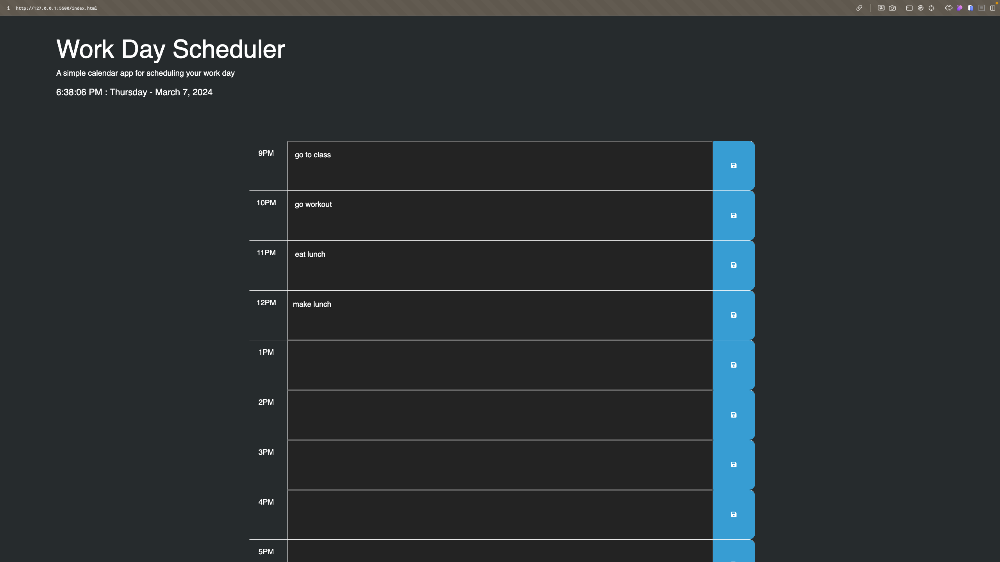

<!-- @format -->

# Work Day Scheduler Starter Code

## Description

This is an HTML, CSS, and Javascript projects that takes advantage of javascript's ability to edit html and create a day planner with dynamic loading of today's date, fetching data, and local storage.

## Table of Contents

- [Description](#description)
- [Installation](#installation)
- [Usage](#usage)
- [Deployed Application](#deployed-application)
- [Screenshot](#screenshot)
- [License](#license)

## Installation

No installation required. You can access the application by clicking on the following link: [Online Planner](https://github.com/jakepears/onlinePlanner)

## Usage

To use the application, click on the link provided in the installation section. Once the application is open, click on the "Generate Password" button. You will be prompted to enter the length of the password you would like to generate. You will then be prompted to select the criteria for the password. You can choose to include lowercase letters, uppercase letters, numbers, and special characters. Once you have selected the criteria, the password will be generated and displayed on the screen.

## Deployed Application

The deployed application can be accessed by clicking on the following link: [Online Planner](https://jakepears.github.io/onlinePlanner/)

## Screenshot

## License

MIT License
